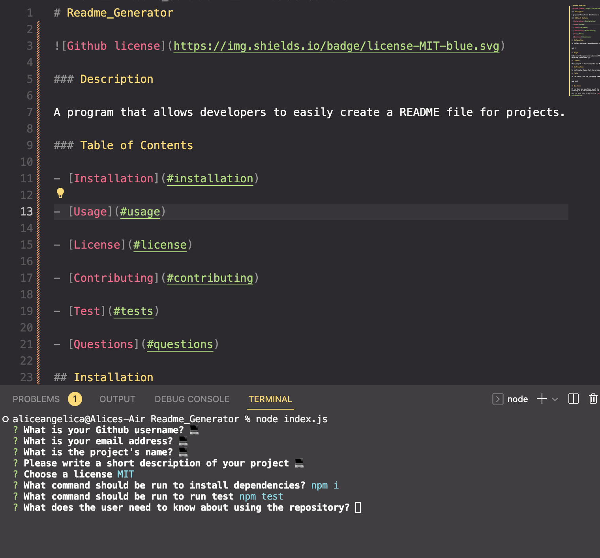

# Readme_Generator


### Description

A program that allows developers to easily create a README file for projects.

### Table of Contents

- [Installation](#installation)

- [Usage](#usage)

- [License](#license)

- [Contributing](#contributing)

- [Test](#tests)

- [Questions](#questions)

## Installation

To install necessary dependencies, run the following command:

```
npm i
```

## Usage

Make sure that you have node installed and run this app in the terminal by entering "node index.js".



## License

This project is licensed under the MIT license.

## Contributing

To contribute please fork the original project first.

## Tests

To run tests, run the following command:

```
npm test
```

## Questions

If you have any questions about the repository, open an issue or contact me directly at Alice123456@hotmail.com.

You can find more of my work at [AliceAngelica](https://github.com/AliceAngelica).

## Deployed webpage link

